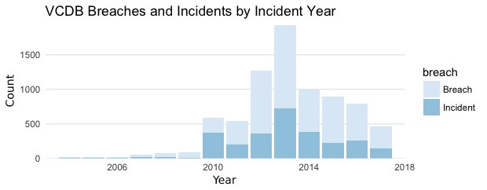

# The VERIS Community Database
Information sharing is a complex and challenging undertaking. If done correctly, everyone involved benefits from the collective intelligence. If done poorly, it may mislead participants or create a learning opportunity for our adversaries. The Verizon RISK Team supports and participates in a variety of information sharing initiatives and research efforts. We continue to drive the publication of the Verizon Data Breach Investigations Report (DBIR) annually, where we have an unprecedented number of new data-sharing partners, and we are committed to keeping the report publicly available and free to download. We regularly receive inquiries about our dataset, and our ability to share further, but we are limited in what data we can share in raw format due to agreements with our partners and customers.

## The Problem
While there are a handful of efforts to capture security incidents that are publicly disclosed, there is no unrestricted, comprehensive raw dataset available for download on security incidents that is sufficiently rich to support both community research and corporate decision-making. There are organizations that collect—and in some form—disseminate aggregated collections, but they are either not in a format that lends itself to ease of data manipulation and transformation required for research, or the underlying data are not freely and publicly available for use. This gap has long hampered researchers who are studying the problems surrounding security incidents, as well as the risk managers who are starved for reliable data upon which to base their risk calculations.

# Getting Involved
If you want to get involved in this project, we have directions in the wiki for this repo.  If you are new to GitHub, it is the book icon to the top of this page section.


# WARNING ON SAMPLING  

Most VCDB issues are chosen randomly (with a preferences for those in the last year), however we specifically select healthcare issues and some priority incidents.  Incidents not chosen randomly can be identified by the value of 'plus.sub_source'.  It will be 'phidbr' for healthcare issues and 'priority' for priority issues.  For those wishing to normalize out non-random selection, here is the issue composition as of Jan 13, 2018 to normalize the actuall incidents to:
```
{
'2013': {'all': 1199, 'phidbr': 0, 'priority': 11},
'2014': {'all': 3885, 'phidbr': 30, 'priority': 113},
'2015': {'all': 1844, 'phidbr': 197, 'priority': 47},
'2016': {'all': 1996, 'phidbr': 516, 'priority': 75},
'2017': {'all': 1826, 'phidbr': 455, 'priority': 75},
'2018': {'all': 28, 'phidbr': 8, 'priority': 1}
}
```

# VCDB Statistics  
As of Jan 13, 2018


```
vcdb %>%
    dplyr::group_by(attribute.confidentiality.data_disclosure.Yes) %>%
    dplyr::count(timeline.incident.year) %>%
    dplyr::ungroup() %>%
    dplyr::rename(breach = attribute.confidentiality.data_disclosure.Yes) %>%
    dplyr::mutate(breach = ifelse(breach, "Breach", "Incident")) %>%
  ggplot2::ggplot() + 
    ggplot2::geom_bar(ggplot2::aes(x=timeline.incident.year, y=n, group=breach, fill=breach), stat="identity") + 
    ggplot2::labs(title="VCDB Breaches and Incidents by Incident Year", x="Count", y="Year") +
    ggplot2::scale_x_continuous(expand=c(0,0), limits=c(2003, 2018)) +
    ggplot2::scale_y_continuous(expand=c(0,0)) +
    ggplot2::scale_fill_brewer() +
    ggplot2::theme_minimal() +
    ggplot2::theme(
        panel.grid.major.x = ggplot2::element_blank(),
        panel.grid.minor.x = ggplot2::element_blank(),
        panel.grid.minor.y = ggplot2::element_blank()
    )
```

 

```
vcdb %>%
    verisr::getenumCI("action", by="asset.variety") %>%
    dplyr::filter(!is.na(n)) %>%
    dplyr::mutate(by = stringr::str_sub(by, 15)) %>%
  ggplot2::ggplot() +
    ggplot2::geom_tile(ggplot2::aes(x=enum, y=by, fill=x)) +
    ggplot2::geom_text(ggplot2::aes(x=enum, y=by, label=x)) +
    ggplot2::scale_fill_gradient2() +
    ggplot2::theme_void() +
    ggplot2::theme(
        axis.text = ggplot2::element_text(),
        axis.text.x = ggplot2::element_text(hjust=1, angle=90)
    )
```


 


# Index
* vcdb_diff.json - An update to the verisc.json schema file to produce the schema file used for the vcdb
* vcdb_diff-labels.json - An update to the verisc-labels.json labels file to produce the vcdb labels file
* vcdb.json - The vcdb schema file
* vcdb-labels.json - The vcdb labels file
* vcdb-merged.json - The full schema, combining the schema file and enumerations from the labels file.
* vcdb-enum.json - A json file containing just the enumerations from the schema.
* vcdb-keynames-real.txt - A text file containing the keys in the vcdb schema.


